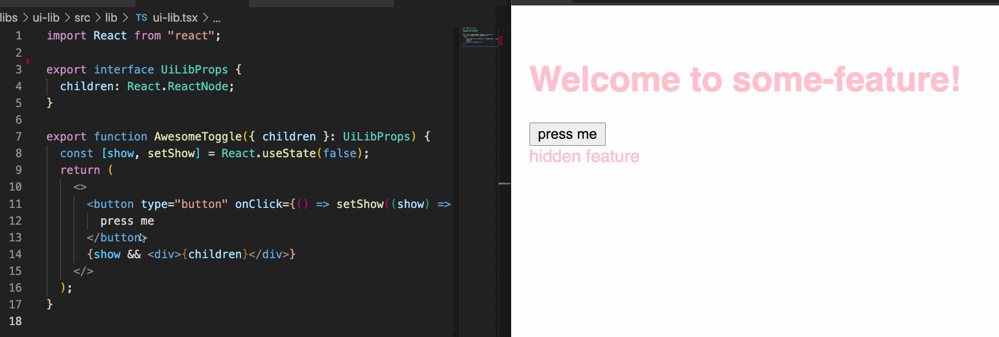

# Add fast refresh to a nrwl nx react app

- [add the react-refresh plugin](https://github.com/sanderdrummer/nx-react-fast-refresh-example/commit/5164120f19c19ecc51363c46448f6f3d33eb6315)
- [add a custom webpack config for each app you want to use fast refresh with](https://github.com/sanderdrummer/nx-react-fast-refresh-example/commit/f28713b1e9bf7b8ebd685234f209345edf23fccb)
- [add an env var for development](https://github.com/sanderdrummer/nx-react-fast-refresh-example/commit/3e80d0ca2bc6a6f8af0e6fc164a9417617abcd7c)
- [configure hmr in plugins and devServer](https://github.com/sanderdrummer/nx-react-fast-refresh-example/commit/7a6145cf55c015340ce8f74fbe6c0dc36ea17d09)
- [replace the default babel-loader with a custom babel-loader that supports fast-refresh](https://github.com/sanderdrummer/nx-react-fast-refresh-example/commit/a44b60babba34a6ecb19803ab6a82d2fce8f8f3d#diff-18f43cb10166a395296df7ca10d683be66b4aad7d1e4e0dad6f446a779ce1fb0)
- [add the fast refresh plugin to the plugins array](https://github.com/sanderdrummer/nx-react-fast-refresh-example/commit/a44b60babba34a6ecb19803ab6a82d2fce8f8f3d#diff-18f43cb10166a395296df7ca10d683be66b4aad7d1e4e0dad6f446a779ce1fb0R32)
